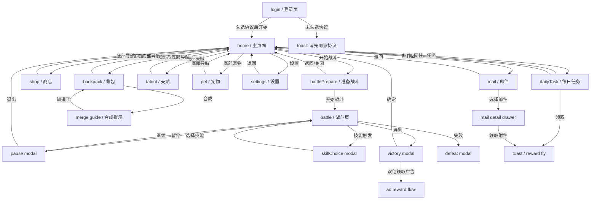
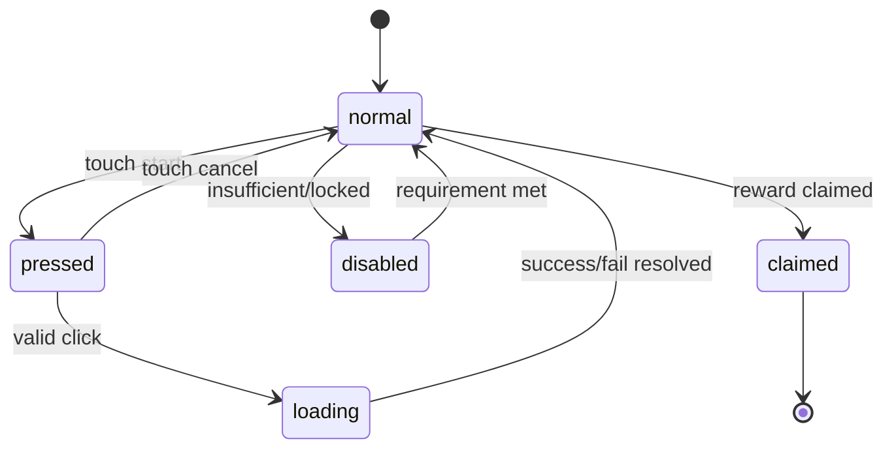
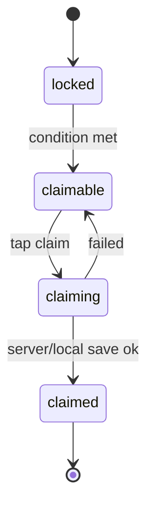
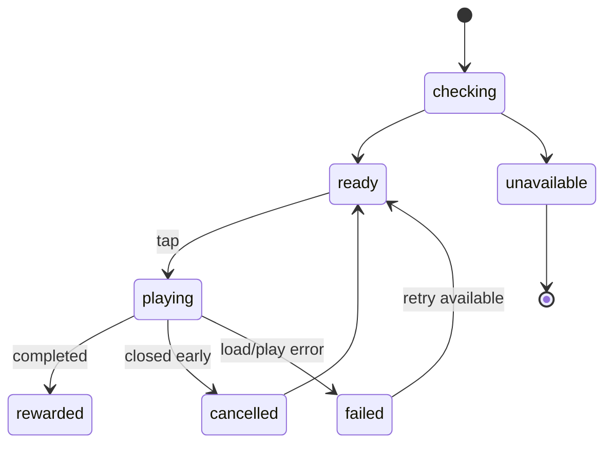

# Screen Flow

UIUXAgent page flow and interaction contract for `猫猫背包守夜`.

## 1. Route Map

## 2. Route Table

| Route | Entry | Exit | Required State |
| --- | --- | --- | --- |
| `login` | app launch, no accepted agreement | `home` | agreement checkbox, age badge, health tip |
| `home` | login success, return from systems | other routes | player resources, red dots, current stage |
| `battlePrepare` | home start battle | `battle`, `home` | stage info, power compare, weapon grid, cost check |
| `battle` | battle prepare start | `victory`, `defeat`, `home` | wave, timer, hp, weapon cooldowns |
| `backpack` | bottom nav | `home`, merge modal | inventory pages, selected item, merge candidates |
| `shop` | bottom nav/resource plus | `home` | shop tab, goods, refresh countdown, ad state |
| `pet` | bottom nav | `home` | selected pet, pet list, upgrade material state |
| `talent` | bottom nav | `home` | active category, scroll offset, remaining points |
| `dailyTask` | home side entry | `home` | daily activity, task list, claim states |
| `achievement` | task/side entry later | `home` | achievement progress, one-tap claim |
| `mail` | home side entry | `home` | mail list, drawer detail, attachments |
| `settings` | home top-right | `home` | toggles, policy links, version |
| `skillChoice` | battle runtime | `battle` | three options, refresh state |
| `victory` | battle win | `home`, ad flow | reward list, double claim state |

## 3. Navigation Rules

1. `home`, `shop`, `backpack`, `talent`, `pet` are hub screens. They use the same `BottomNav`.
2. `battle`, `battlePrepare`, `login`, and blocking modals hide `BottomNav`.
3. Hardware/back button policy:
   - Modal open: close modal if allowed.
   - Secondary screen: return to `home`.
   - `battle`: open pause modal, never immediately exit.
   - `login`: no-op or platform exit.
4. Red dots are calculated centrally and passed into `BottomNav`, side entries, and cards. UI components do not compute feature eligibility.
5. Route changes should keep previous hub scroll/tab state unless explicitly refreshed.

## 4. Key User Flows

### 4.1 First Launch

1. Show `login`.
2. Player taps `开始游戏`.
3. If agreement unchecked: show toast `请先阅读并同意用户协议和隐私政策`.
4. If checked: persist acceptance and route to `home`.
5. First-time player sees tutorial red dots for `开始战斗` and `背包合成` later.

### 4.2 Core Loop

1. `home`: player checks resources and current chapter.
2. Tap `开始战斗`.
3. `battlePrepare`: compare recommended power and own power.
4. Tap `开始战斗`; spend energy or premium cost depending product rules.
5. `battle`: weapons auto attack; optional skill choices appear.
6. Win opens `victory`; rewards animate.
7. Confirm returns to `home`.
8. Player opens `backpack` to merge, then `pet`/`talent` to grow, then starts a higher wave.

### 4.3 Backpack Merge

1. Enter `backpack` from bottom nav.
2. Select an item. Detail panel updates.
3. If two mergeable items exist, `合成` is enabled and candidate cards glow.
4. Tap `合成`.
5. If first time: open `merge guide`.
6. Merge success shows burst and result detail.
7. Inventory refreshes and selected item becomes the result.

### 4.4 Shop Purchase And Refresh

1. Enter `shop` from bottom nav or resource plus.
2. Select tab: `每日商店`, `钻石商店`, `特惠礼包`.
3. Tap goods card price button.
4. UI enters `loading`; on success show reward fly/toast; on insufficient currency route to top-up/shop tab.
5. Tap `刷新`.
6. If ad refresh: call ad state flow; if no ad, show fallback toast.

### 4.5 Mail Mobile Flow

1. Enter `mail`.
2. Show only mail list plus bottom actions by default.
3. Tap mail row.
4. Open `MailDetailDrawer` over list.
5. Claim attachment from drawer; row state updates.
6. Close drawer returns to list.

This replaces the permanent two-column reference layout on phone widths.

### 4.6 Talent Tree Flow

1. Enter `talent`.
2. Pick category tab.
3. Scroll tree vertically; later version may allow pinch/zoom.
4. Tap available node.
5. Show node detail/confirm if point spend is irreversible; otherwise upgrade immediately.
6. Updated nodes pulse gold and connected lines light up.

### 4.7 Victory Double Claim

1. `victory` shows base rewards.
2. `双倍领取` checks ad service state.
3. States:
   - `ready`: play ad, then double reward.
   - `loading`: disable both buttons.
   - `cancelled`: show `完整观看广告后可获得双倍奖励`.
   - `failed`: show retry.
   - `unavailable`: fall back to normal claim.
4. `确定` always claims base reward once and exits.

## 5. Screen Layout Contracts

### 5.1 Login

- Logo top range: `y 390-560`.
- Main cat/camp art center: `y -70-260`.
- Start button: bottom center above agreement, size about `430 x 112`.
- Agreement and CADPA remain visible at all times.
- Health tip pinned above safe bottom.

### 5.2 Home

- Player plate top-left, resource bar top-right, settings at far right.
- Stage card centered above cat/camp scene.
- Side entries right column, never over start button.
- Start battle button centered above bottom nav.
- Bottom nav occupies safe bottom and is always above device gesture area.

### 5.3 Battle Prepare

- Full dark rounded panel with `WoodHeader`.
- Preview art occupies top-middle.
- Power compare sits below preview.
- Weapon grid has exactly 2 rows.
- Start button stays above agreement/CADPA line.

### 5.4 Battle

- Top HUD: wave, timer, pause, HP/progress.
- Combat field reserves center `y -360 to 300`.
- Weapon bar fixed bottom height, cards shrink on short screens before moving up.
- Damage numbers and bullets live in `EffectLayer`.

### 5.5 Backpack

- Header and tabs pinned.
- Item grid scrolls if page has more than visible rows.
- Detail panel pinned bottom above action buttons.
- `开箱` button can show red dot/count for available chests.

### 5.6 Shop

- Resource bar top, wood sign title below.
- Three-column card grid with `18` horizontal gap.
- Refresh countdown and button below grid.
- Bottom nav pinned.

### 5.7 Pet

- Detail area top, list below.
- The selected pet card is highlighted.
- Locked cards show condition and do not open upgrade action.
- Bottom nav pinned.

### 5.8 Daily Task And Achievement

- Header pinned.
- Activity/summary block pinned at top.
- List scrolls.
- One-tap claim footer pinned for achievement.

### 5.9 Mail

- Header pinned.
- Mail list scrolls.
- Detail drawer overlays from right/bottom based on viewport.
- Bottom actions remain reachable when drawer is closed.

### 5.10 Settings

- Header pinned.
- Toggle block centered in parchment panel.
- Policy/help buttons use blue buttons.
- Version plate pinned bottom.

## 6. UI State Machines

### 6.1 Button State

### 6.2 Reward Claim State

### 6.3 Ad Button State

## 7. Acceptance Checklist For UI

- All screens fit `750 x 1334` without text overlap.
- Safe top/bottom areas do not hide buttons on full-screen phones.
- Bottom nav order and selected state are consistent.
- Buttons have press feedback and disabled state.
- Claim, selected, locked, red dot, and new states are visually distinct.
- Mail details are usable on narrow screens through drawer/modal.
- Talent tree scrolls and does not compress unreadably.
- Pet page avoids duplicate separate detail flow in MVP.
- Placeholder textures can be replaced by asset keys without script changes.
- Every core component exposes `apply(data)` for later game-state binding.

